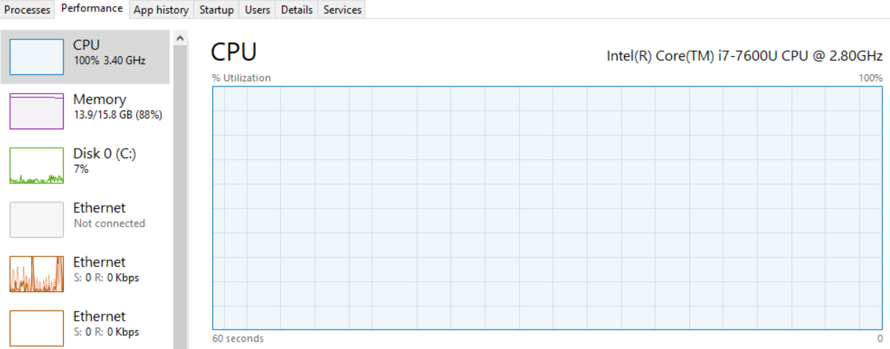
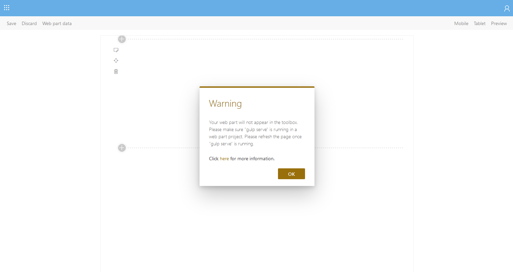
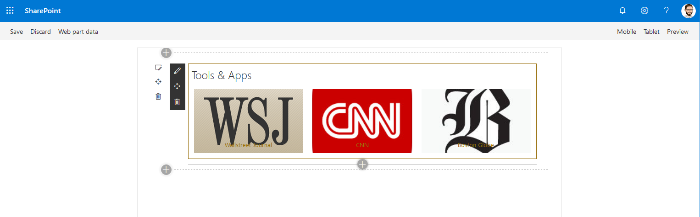
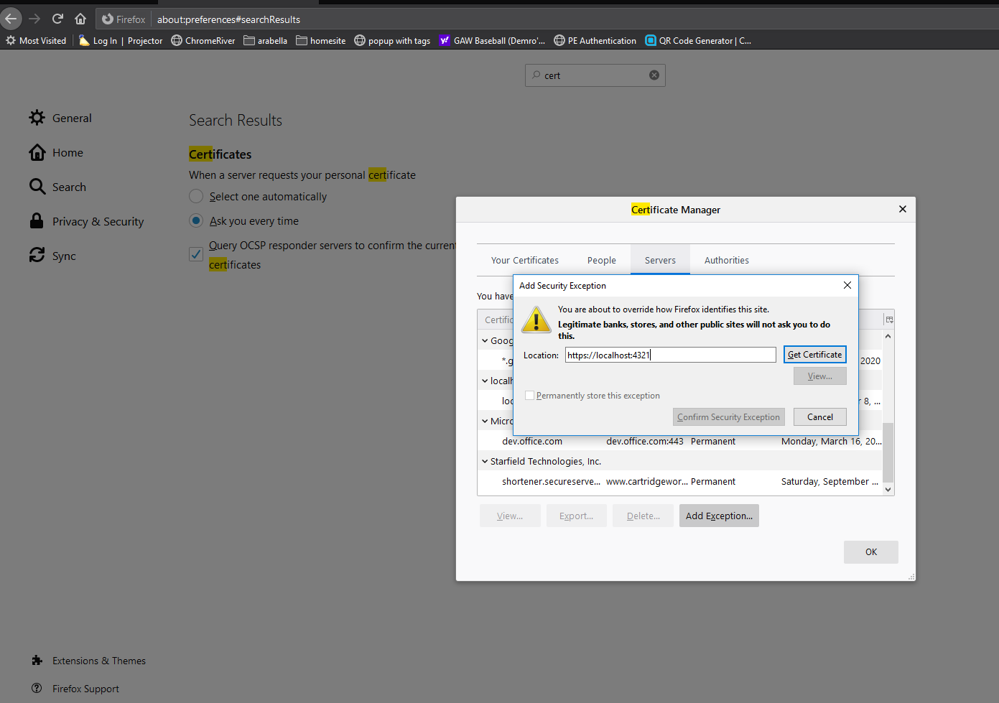

https://pdemro.com/spfx-proxy-debugging-in-a-vm/

# The Problem
My work laptop's image is full of spyware, bloatware, inventory management, anti-phishing and anti-virus applications.  As time goes on between imaging, the bloat becomes worse until a relatively powerful i7 CPU, 16GB ram laptop *with* SSD slows to a crawl.  Introduce a [global pandemic](https://www.bbc.com/news/world-us-canada-51949243) and the necessity to use collaboration fat applications like [Microsoft Teams](https://microsoftteams.uservoice.com/forums/555103-public/suggestions/17219609-teams-uses-600mb-and-is-super-slow), you end up with a very expensive and very hot to-the-touch terminal brick which has difficulty running any modern development stack.

My company also has a [large SpFx application](https://www.onewindowapp.com/) which we are responsible for maintaining.  Pair these two together, and you enter a situation where you must quickly triage and support the application while running under the organizational hardware & software constraints.

 *Trying to avoid this situation*


# The options

## Option 1, expensive VM
Many of my coworkers have opted to simply spin up virtual machines in a cloud service of choice to host any and all development activity.  The problem with this approach is that powerful virtual machines are expensive.  SpFx does not take a super computer to run quickly, but Windows apparently does.  

## Option 2, cheap Linux VM w/ desktop UI installed
A cheap Linux VM would be an option.  Cheap Linux VMs generally don't come with a desktop UI installed which is a requirement for the typical SpFx debugging scenario.  So option 2 - spin up a cheap Linux VM, install a UI (unity, Cinnamon, etc.) and do SpFx development on the VM.

## Option 3, the "nuclear" option
Another option of course is to format my work laptop with whatever OS I want.  The problem with this approach is I need to VPN from time to time to the mothership which is impossible without being joined to the domain.

## Option 4, what I did
Spin up a cheap Linux VM (about $6/month) with my free Azure credits and proxy all SpFx requests to the VM rather than my local machine for debugging.  Use an rsync monitor to diff copy files from my local dev environment to the VM.  

No matter what option you choose, if your company imposes crippling "governance" applications on your laptop it is worth investigating alternatives.

**TLDR; SpFx gulp serve builds on the dedicated $6/month Linux VM run 90% faster than on my local organization-issued laptop.**  This tutorial will show you how to offload SpFx transpile and hosting to a remote VM using reverse proxies.

# Overview


1. SharePoint's _layouts/15/workbench.aspx requests manifest.json from https://localhost:4321
2. reverse-proxy intercepts this request and sends it to my Linux VM on :4322
3. reverse-proxy on my Linux VM intercepts this request and routes it to http://localhost:4333 (where SpFx is running with gulp serve)
4. SpFx returns the manifest.json to SharePoint 365
5. After adding a webpart from the bundle, SharePoint 365 requests Javascript assets from SpFx on :4333 (SpFx is configured to run on this port).
6. Another reverse-proxy intercepts this request and relays it to my Linux VM
7. reverse-proxy #3 again intercepts this request and relays it to SpFx hosted on :4333
8. Every few seconds, rsync sends file modifications to Linux VM.  This will trigger gulp watch and start another build.

# Proxy Setup
## 1. Prerequisites
* Linux virtual machine & SSH configured
* SpFx development environment on laptop and Linux server (Node, Gulp, etc.)
* Install [@cedx/reverse-proxy](https://dev.belin.io/reverse-proxy.js/) both locally and on the remote server
* Clone your SpFx code on both Laptop and Linux server
* Install [cygwin](https://www.cygwin.com/) on the local windows machine.  Make sure to include ssh and rsync during the install process
  * If you want to run the commands below in a standard powershell window, I recommend adding `C:\cygwin64\bin` to your system path

## 2. Set Firewall rules for Linux server
For this exercise, you will need to update firewall rules for your server to allow :4322.  In Azure this is done by navigating to the VM's blade and selecting `Networking > Add Inbound Port Rule`


## 3. Fork & Clone Stub Project
I have created a repository with a stub of the configurations you will need for this setup.  I recommend you fork the following project and add the specific configurations I will walk through next.

Clone the project on both the local laptop and on the remote server

https://github.com/pdemro/spfx-proxy-debug

1. Replace IP address x.x.x.x in all files with the IP address for your Linux server

## 4. Start the reverse proxies
In this step we will start the reverse proxies on both the local laptop and on the remote server.  The proxies allow requests to be routed from SharePoint to the remote server for compiling and debugging

### Local Laptop
* Open a terminal window and type:
`reverse proxy -c c:\path\to\spfx-proxy-debug\laptop\laptop-proxy1-proxy2-config-ssl.json`

### Remote server
* Through an ssh connection start the reverse proxy:
`reverse proxy -c c:\path\to\spfx-proxy-debug\laptop\laptop-proxy1-proxy2-config-ssl.json`

## 5. Run gulp serve on Remote laptop
* Execute `gulp serve --nobrowser` on the remote machine via ssh connection (in your SharePoint Framework project directory

## 6. Test the Connection
At this point you should be able to serve files from your SpFx project using the remote server.  Go to a site in your SharePoint 365 environment and navigate to `/_layouts/15/workbench.aspx`.  You will be prompted with the dialog below.  Just press OK and you should be able to select webparts from your project from the debug dashboard over HTTP.  



*Warning dialog*

The warning dialog appears because it can't find your SpFx project hosted over HTTPS.  SharePoint does fall back to HTTP gracefully, despite the warning message.  You should still be able to select and add the webparts from your project:




# File Synchronization
None of this is useful if you can't actually write code, compile real-time and see the changes appear in SharePoint.  For this use case, you can use the Linux utility `rsync`.  `rsync` should be available with a normal powershell window as long as you've installed cygwin in the prerequisite steps above and added `C:\cygwin64\bin` to your system path.

* There is a PowerShell script included in the spfx-proxy-debug stub project forked & cloned for this tutorial.  Open ./laptop-proxy/rsync-monitor.ps1
* Replace `'/cygdrive/c/path/to/spfx/project'` with the actual path to your SharePoint framework project cloned locally
* Replace `linuxUser` with the user you are using to ssh to the remote machine
* Replace `/path/to/spfx/project/linux` with the path for the project on the remote machine
* Once the script has been updated and saved, you can run it in a PowerShell session on the local machine
```powershell
./rsync-monitor.ps1
```
While this is running, any changes you make to the local project will be automatically synchronized with the associated folder in the remote server.  Here is what the file looks like for my environment:

```powershell

while(1) {
    rsync -azP --exclude node_modules --exclude .git --exclude temp --exclude sharepoint --exclude lib --exclude dist '/cygdrive/c/path/to/spfx/project' linuxUser@x.x.x.x:/path/to/spfx/project/linux

    Start-Sleep -Seconds 5
}
```
> Note the `/cygdrive/` notatation for the local folder path.  This is required for rsync running under the Cygwin context

# SSL
You can get rid of the annoying dialog from SharePoint by hosting the proxy locally using SSL.  

* Create a certificate using OpenSSL.  Store the public cert and key where you like, but I recommend putting them in the ./laptop-proxy/certs directory I've included for you in the stub project:

```bash
openssl req -x509 -newkey rsa:4096 -keyout key.pem -out cert.pem -days 365
```

* I have included a second proxy configuration file in the stub project with a reference to the certificate.  Replace the paths for the cert and key with the cert and key you just created.  Then restart the proxy service using the new config file.  Here is what mine looks like:

```json
[
  {
    "address":"127.0.0.1",
    "port": 4321,
    "target": "http://52.173.23.153:4322",
    "ssl": {
      "cert":"./laptop-proxy/certs/spfx-cert.pem",
      "key":"./laptop-proxy/certs/spfx-cert-key.pem"
    },
    "comment": "IP address changes every day if you use auto-shutdown.  Pro-tip, use auto shutdown to save $$"
  },
  {
    "address":"127.0.0.1",
    "port": 4333,
    "target": "http://52.173.23.153:4322"
  }
]
```
Finally, you'll need to trust this certificate on your local machine to avoid browser warnings/errors.  The easiest way to do this is to convert it to a pfx first, then just double-click on it.

```bash
openssl pkcs12 -inkey key.pem -in cert.pem -export -out spfx-self-signed.pfx
```

## FireFox

[I highly recommend using FireFox](https://pdemro.com/basic-browsing-privacy/).  FireFox uses its own trusted certificate store.  To add the cert to FireFox:
1. Start the reverse proxy service using the SSL configuration above `reverse-proxy -c .\laptop-proxy\laptop-proxy1-proxy2-config-ssl.json`
2. Go to `options > search "certificates" > view certificates > Servers Tab > Add Exception > type in https://localhost:4321 > press "get certificate" > confirm security exception.

> If the proxy isn't running or isn't running with the SSL option, FireFox won't be able to grab the certificate for the exception



# Remarks
Is this solution over-engineered?  Without a doubt.  It solves a niche problem in my case which I hope will return my time investment in re-captured efficiency.  I am mostly posting this for my own reference later when it inevitably breaks, but I hope it can be helpful for some other sucker working with a hot brick company laptop
